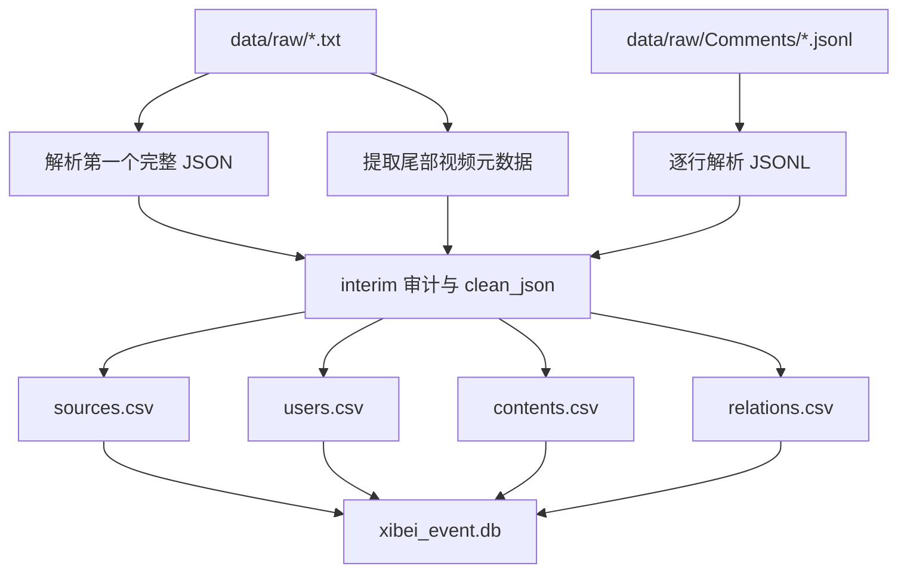

# 01 数据工程链路：从 raw 文件到干净 CSV 与数据库

## 1. 原始数据的真实形态

项目起点是 `data/raw/` 中的 B 站评论原始数据。它并不是单一格式的数据集，而是两类数据混合：

1. 旧版 `.txt` 文件：文件开头是 B 站评论接口返回的 JSON，尾部追加了视频元数据块。
2. 新版 `Comments` JSONL 文件：按行保存结构化 JSON 记录，包含视频详情、创作者信息、评论和回复。

旧版 `.txt` 文件的问题在于：虽然主体是 JSON，但尾部元数据不一定是合法 JSON。因此不能直接读取整个文件，而必须从文件开头解析第一个完整 JSON 对象，再把剩余文本作为元数据块处理。

项目采用的原则是：

```text
raw 原始文件不修改
先做文件审计
再解包评论 JSON 和视频元数据
最后进入结构化建模
```

## 2. 清洗脚本与处理步骤

核心处理脚本是：

```text
data/process_bilibili_raw.py
```

它主要完成九件事：

1. 扫描 `data/raw/` 中的旧版 txt 文件。
2. 从每个文件开头解析第一个 B 站评论 JSON。
3. 从文件尾部提取 `video_name`、`video_time`、`video_user_uid`。
4. 扫描 `data/raw/Comments/` 中的新版 JSONL 文件。
5. 从 `detail_contents`、`detail_creators`、`detail_comments` 中提取视频源、UP 主、评论和回复。
6. 输出 raw 文件审计报告。
7. 输出解包后的干净 JSON。
8. 合并生成第一层事实数据 CSV。
9. 写入 SQLite 数据库。

整体处理链路如下：



## 3. 中间产物

清洗后产生的中间结果位于：

```text
data/interim/
  raw_file_audit.csv
  comments_file_audit.csv
  bilibili_video_meta.csv
  raw_records.csv
  bilibili_clean_json/
```

这些文件的作用分别是：

| 文件 | 作用 |
|---|---|
| `raw_file_audit.csv` | 记录旧版 txt 文件是否为空、能否解析、是否含元数据 |
| `comments_file_audit.csv` | 记录新版 JSONL 文件行数、错误行数等质量信息 |
| `bilibili_video_meta.csv` | 保存从尾部元数据中抽取的视频信息 |
| `raw_records.csv` | 对 raw 记录做统一索引 |
| `bilibili_clean_json/` | 保存从旧版 txt 解包出的干净 JSON |

审计发现有 1 个旧版 raw 文件为空，无法解析：

```text
data/raw/9月16事态升级【罗永浩VS西贝】大卫哥双开巅峰赛！.txt
```

其余 16 个旧版 txt 文件均成功解析。新版 `Comments` JSONL 文件共 12 个，错误行数为 0。

## 4. 第一层事实表

清洗脚本将原始评论归一化成四张事实表，位于：

```text
data/layer1/
  sources.csv
  users.csv
  contents.csv
  relations.csv
```

### 4.1 sources.csv

`sources.csv` 表示视频源，一个 B 站视频对应一条 source。

关键字段包括：

```text
source_id
platform
source_type
source_title
platform_source_id
source_url
author_user_id
published_at
raw_file_path
comment_all_count
page_reply_count
has_next_offset
```

### 4.2 users.csv

`users.csv` 表示评论用户、回复用户和部分创作者用户。

关键字段包括：

```text
user_id
platform
raw_user_id
user_name
user_type
avatar_url
gender
profile_text
level
first_seen_time
last_seen_time
raw_data
```

### 4.3 contents.csv

`contents.csv` 是后续分析最核心的表。一级评论和楼中楼回复都进入该表。

关键字段包括：

```text
content_id
platform
source_id
raw_content_id
content_type
user_id
content_text
created_at
like_count
parent_content_id
root_content_id
raw_file_path
raw_data
```

### 4.4 relations.csv

`relations.csv` 表示评论关系。

关系类型有两类：

| relation_type | 含义 | 数量 |
|---|---|---:|
| `comment_source` | 用户评论某个视频 | 13510 |
| `reply` | 用户回复另一条评论 | 27293 |

## 5. SQLite 数据库

CSV 之外，项目还生成了 SQLite 数据库：

```text
data/database/xibei_event.db
```

数据库表包括：

```text
raw_records
raw_file_audit
comments_file_audit
sources
users
contents
relations
```

当前数据库统计如下：

| 表 | 数量 |
|---|---:|
| `raw_records` | 29 |
| `sources` | 32 |
| `users` | 28343 |
| `contents` | 40803 |
| `relations` | 40803 |

内容结构如下：

| content_type | 数量 |
|---|---:|
| `comment` | 13510 |
| `reply` | 27293 |

这说明数据中楼中楼回复明显多于一级评论。后续语义分析因此不能只看一级评论，还需要关注回复区中的争论、附和和情绪共振。

## 6. 为什么这一步重要

原始 raw 文件只能说明“我们采过数据”，不能直接支撑结论。数据工程链路解决了三个关键问题：

1. **可追溯**：每条内容保留 `raw_file_path`，可以回到原始文件。
2. **可查询**：SQLite 数据库让我们可以按视频源、用户、时间、评论层级和关系类型查询。
3. **可分析**：`contents.csv` 和 `relations.csv` 为热度分析、互动网络分析和语义模型预测提供了统一输入。

如果没有这一步，后面的模型微调和语义分析会失去可信的数据底座。
