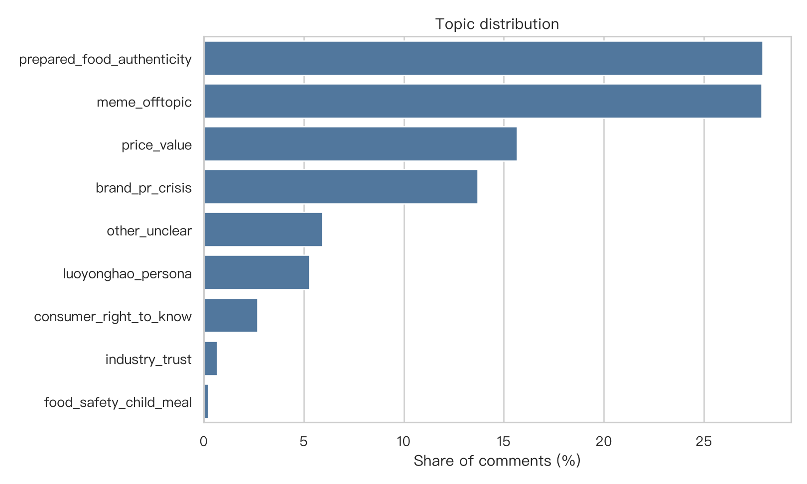
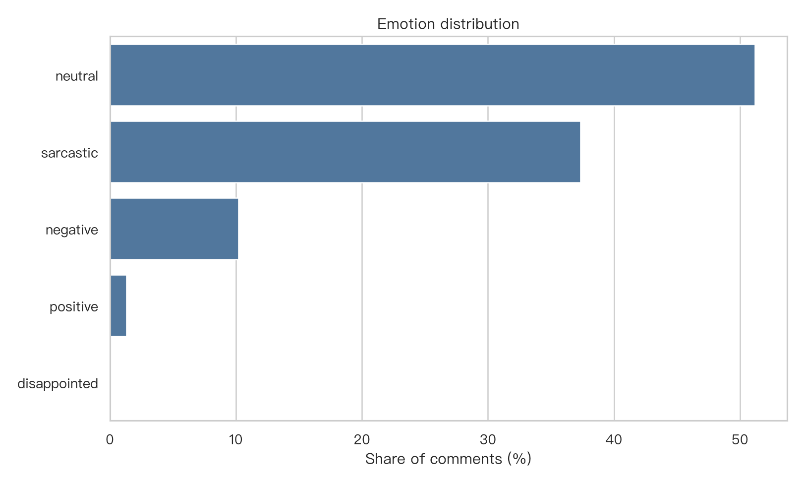
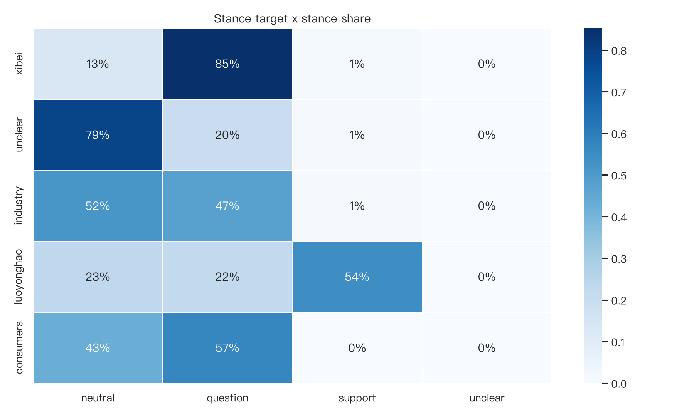
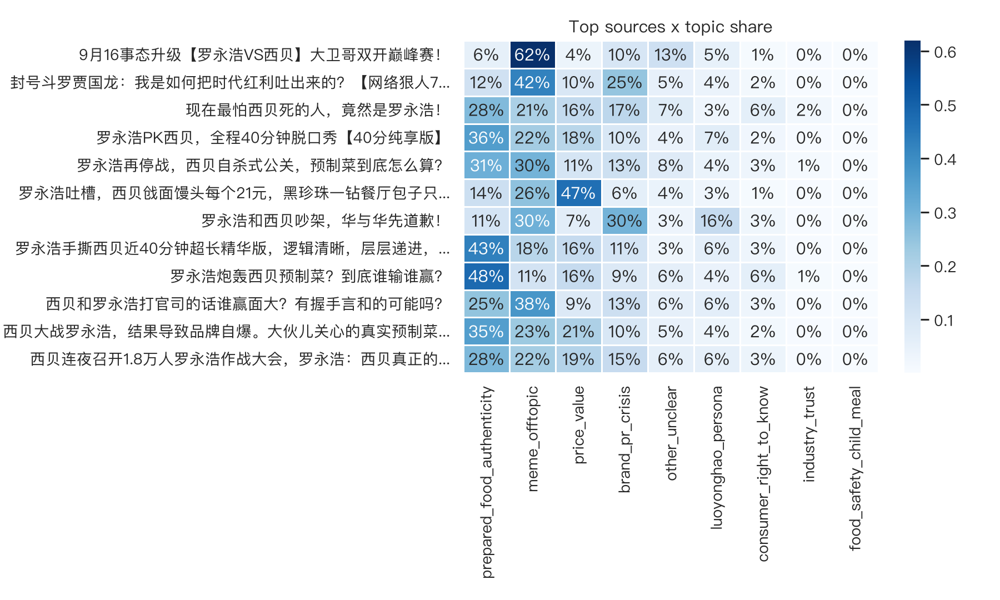
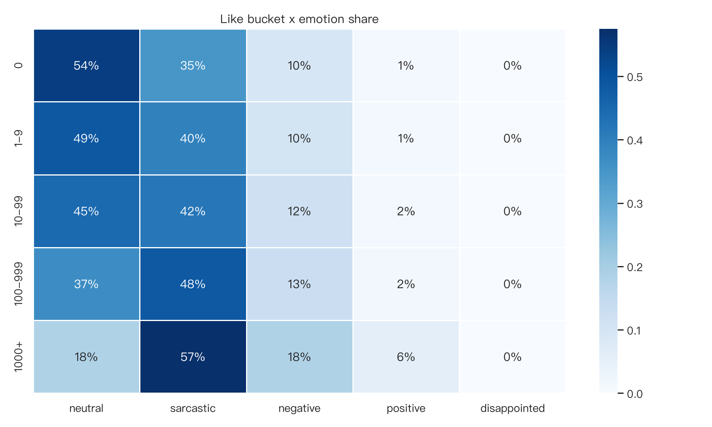
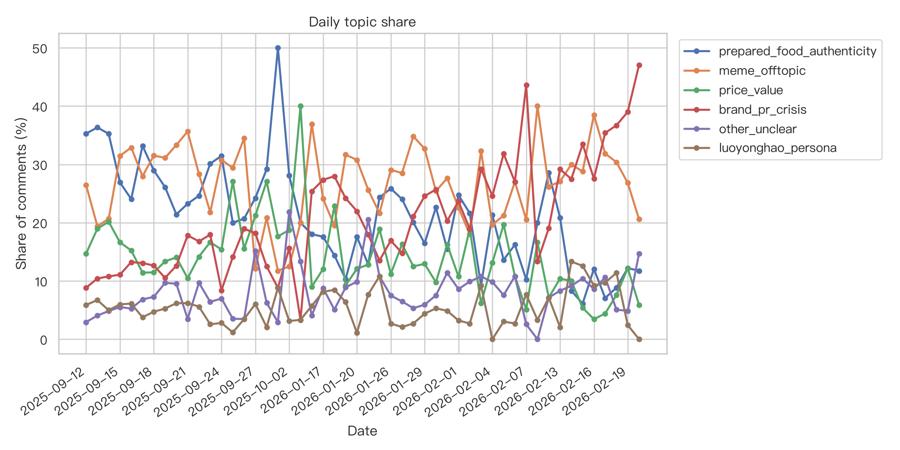

# 03 分析结果与讨论：从语义标签到舆论结构解释

## 1. 分析对象与口径

本章基于：

```text
情感分析/outputs/predictions/full_semantic_predictions.csv
```

该文件包含 40803 条 B 站评论，覆盖 32 个视频源。其中：

| 类型 | 数量 |
|---|---:|
| 一级评论 comment | 13510 |
| 楼中楼回复 reply | 27293 |

语义标签来自四个 MacBERT 单标签分类器：

```text
topic
emotion
stance_target
stance
```

分析产物位于：

```text
情感分析/outputs/analysis/four_dim_semantic/
  report.html
  metrics.json
  tables/
  figures/
```

## 2. 主题结构：真实性争议与玩梗传播几乎并列



主题分布说明，西贝事件评论区不是单一的“预制菜事实讨论”。

| 主题 | 数量 | 占比 |
|---|---:|---:|
| `prepared_food_authenticity` | 11405 | 27.95% |
| `meme_offtopic` | 11379 | 27.89% |
| `price_value` | 6390 | 15.66% |
| `brand_pr_crisis` | 5588 | 13.70% |
| `other_unclear` | 2421 | 5.93% |
| `luoyonghao_persona` | 2155 | 5.28% |
| `consumer_right_to_know` | 1101 | 2.70% |
| `industry_trust` | 276 | 0.68% |
| `food_safety_child_meal` | 88 | 0.22% |

**解释：** `prepared_food_authenticity` 与 `meme_offtopic` 几乎并列，说明评论区同时存在两条主线：一条是围绕预制菜、食材真实性和知情权的事实争议；另一条是围绕罗永浩、西贝回应、网友二创形成的玩梗传播。

这对内容安全分析很重要。因为玩梗评论未必提供事实信息，但它能放大事件热度，并把品牌危机转化为可传播的公共叙事。

## 3. 情绪结构：中性围观与反讽传播占主导



情绪分布如下：

| 情绪 | 数量 | 占比 |
|---|---:|---:|
| `neutral` | 20876 | 51.16% |
| `sarcastic` | 15237 | 37.34% |
| `negative` | 4157 | 10.19% |
| `positive` | 532 | 1.30% |
| `disappointed` | 1 | 0.00% |

**解释：** 这个评论区不是纯粹愤怒型舆情。中性评论最多，说明大量评论是围观、转述、补充信息或普通讨论；反讽评论接近四成，说明事件传播高度依赖玩笑、阴阳怪气和二创表达。

因此，用“正负面情绪占比”解释该事件会过于粗糙。更合适的说法是：西贝事件在 B 站形成了反讽化、娱乐化和质疑性表达共存的评论空间。

## 4. 立场结构：核心组合是质疑西贝



立场方向中：

| 立场方向 | 数量 | 占比 |
|---|---:|---:|
| `question` | 22016 | 53.96% |
| `neutral` | 16849 | 41.29% |
| `support` | 1917 | 4.70% |
| `unclear` | 21 | 0.05% |

立场对象中：

| 立场对象 | 数量 | 占比 |
|---|---:|---:|
| `xibei` | 18419 | 45.14% |
| `unclear` | 13272 | 32.53% |
| `industry` | 6527 | 16.00% |
| `luoyonghao` | 2578 | 6.32% |
| `consumers` | 7 | 0.02% |

**解释：** 评论区最核心的组合是“质疑西贝”。这与事件本身的品牌回应、预制菜解释、价格争议密切相关。

但 `unclear` 对象占 32.53%，不能忽略。大量评论其实并不明确站队，而是玩梗、围观、借题发挥或参与二创。这说明评论区舆论不是简单的品牌支持/反对二分，而是由明确质疑和泛娱乐讨论共同构成。

## 5. 视频源差异：不同视频承载不同评论区氛围



视频源交叉分析显示，不同视频下的评论主题结构差异明显。

评论量最高的视频是：

```text
西贝大战罗永浩，结果导致品牌自爆。大伙儿关心的真实预制菜吗？
```

该视频共有 7096 条评论，最大主题是 `prepared_food_authenticity`，占 35.47%。它更像事实争议和品牌危机的入口。

而：

```text
9月16事态升级【罗永浩VS西贝】大卫哥双开巅峰赛！
```

该视频中 `meme_offtopic` 占 61.92%，说明它更像事件娱乐化、二创化和玩梗传播的入口。

**解释：** 视频不是中性的承载容器。标题、UP 主表达方式、视频剪辑风格和评论区初始氛围，都会影响评论主题分布。后续如果研究评论区圈层化，不应只看全平台汇总，还要看不同视频源的局部语义结构。

## 6. 点赞放大：平台互动机制选择性放大反讽与负面



高赞评论与总体评论存在差异。

| 情绪 | 总体占比 | Top 5% 高赞占比 | Top 1% 高赞占比 |
|---|---:|---:|---:|
| `sarcastic` | 37.34% | 46.32% | 52.32% |
| `negative` | 10.19% | 11.70% | 14.18% |
| `neutral` | 51.16% | 40.23% | 31.30% |
| `positive` | 1.30% | 1.74% | 2.20% |

**解释：** 高赞区不是总体评论的等比例缩影。反讽和负面表达在高赞评论中更突出，中性评论占比下降。这说明平台互动机制更容易放大能够引发共鸣、转述和二次传播的表达。

对内容安全分析而言，这一点比单纯负面评论占比更重要。真正影响舆论可见性的，往往不是评论总量最多的表达，而是在点赞、回复和转述中被推到前台的表达。

## 7. 时间演化：事件高峰集中，长尾日期需要谨慎解释



全量日期共有 216 个，但事件主峰高度集中：

| 日期 | 评论数 |
|---|---:|
| 2025-09-13 | 4505 |
| 2025-09-14 | 6900 |
| 2025-09-15 | 7227 |
| 2025-09-16 | 6065 |
| 2025-09-17 | 3447 |
| 2025-09-18 | 1377 |

后续许多日期只有个位数或十几条评论。因此本报告只对活跃日期进行时间主题变化展示，不对低样本长尾日期做强解释。

**解释：** 事件讨论在 2025 年 9 月中旬形成集中爆发，后续进入长尾传播。时间图适合用于观察主题迁移，但若要做更强的事件机制解释，需要补充品牌回应、罗永浩直播、相关视频发布时间等事件节点。

## 8. 综合讨论：评论区的四层结构

根据以上结果，可以把西贝事件 B 站评论区理解为四层结构：

1. **事实争议层。** 用户围绕预制菜、食材真实性、消费者知情权讨论事实问题。
2. **价值判断层。** 用户围绕价格、性价比、品牌信任和行业信任表达判断。
3. **传播表达层。** 反讽、玩梗和人物叙事让事件更容易被转述。
4. **平台互动层。** 点赞和回复机制选择性放大更具传播性的表达。

这四层共同构成一个复合舆论场。品牌危机并不是由某一个标签单独造成，而是由事实争议、情绪表达、人物叙事和平台互动共同推动。

## 9. 内容安全视角下的结论

从内容安全角度看，西贝事件评论区的风险不应简单理解为“负面情绪很多”。更准确的风险结构是：

1. 质疑立场集中指向西贝，容易形成品牌信任压力。
2. 反讽表达占比高，容易在平台内形成二次传播和模因化扩散。
3. 高赞机制放大反讽和负面表达，使少部分评论获得更高可见性。
4. 不同视频源形成不同评论氛围，局部评论区可能出现更强圈层化。

因此，如果要进行平台治理或品牌危机应对，不能只统计负面比例，而应关注“哪些表达被点赞放大”“哪些视频源形成主题集中”“哪些评论层级承载争论扩散”。

## 10. 局限

本章结论需要受以下限制约束：

1. 四维标签来自模型预测，模型训练标签来自 DeepSeek 伪标签，不是人工金标准。
2. 小类标签样本较少，不能做强解释。
3. 点赞数表示平台内部互动反馈，不等于真实公众态度。
4. B 站评论区不能代表全网舆论。
5. 时间演化分析没有叠加完整事件节点，只能说明趋势，不能直接推断因果。

在这些限制下，本报告适合支撑课程设计、项目复盘和论文初稿中的趋势性分析；若要进入更严格研究，需要补充人工标注校验和跨平台数据。
