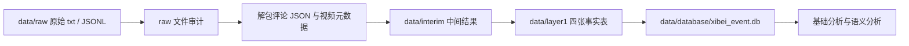

# 西贝事件 B 站评论分析项目总报告

## Executive Summary

**本项目完成了一条从原始评论文件到语义分析结论的完整链路。** 我们从 `data/raw/` 中结构不统一的 B 站评论原始文件出发，经过审计、JSON 解包、CSV 标准化和 SQLite 入库，最终形成 32 个视频源、28343 个用户、40803 条评论内容和 40803 条互动关系的结构化数据底座。

**项目没有停留在普通情绪三分类，而是转向多维评论语义理解。** 我们设计了主题、立场对象、立场方向、情绪、话语方式、风险特征等维度；先用 DeepSeek 对 1500 条抽样评论做伪标签标注，再构建 1349 条可用训练样本，用 MacBERT 微调出 topic、emotion、stance_target、stance 四个单标签分类器。

**最终全量分析显示，西贝事件评论区是“事实争议 + 玩梗反讽 + 价格价值 + 品牌危机”的复合舆论场。** 在 40803 条全量预测评论中，`prepared_food_authenticity` 占 27.95%，`meme_offtopic` 占 27.89%，二者几乎并列；情绪上 `neutral` 占 51.16%，`sarcastic` 占 37.34%；立场方向中 `question` 占 53.96%，立场对象中 `xibei` 占 45.14%。

**内容安全风险更像是互动机制放大后的表达结构，而不是简单的负面情绪堆积。** 高赞评论中反讽、负面和品牌危机相关表达更突出，说明平台互动机制更容易放大可转述、可玩梗、带批评意味的表达。这为后续讨论评论区圈层化、品牌危机扩散和内容安全风险提供了依据。

## 1. 项目从什么问题开始

最初的问题很朴素：我们手里有一批围绕西贝预制菜事件采集的 B 站评论原始文件，希望判断这些评论能否支撑一次内容安全与舆论分析。

但原始文件并不是可以直接分析的表格。`data/raw/` 中既有旧版 `.txt` 文件，也有新版 `Comments` JSONL 文件。旧版 `.txt` 文件虽然后缀是文本，但内部通常由两部分拼接而成：

```text
第 1 段：B 站评论接口返回的 JSON 数据
第 2 段：人工或脚本追加的视频元数据块
```

尾部元数据不一定是合法 JSON，因此不能简单地把整份文件作为 JSON 读取。这个限制决定了项目第一步必须是数据工程，而不是直接做情绪分析。

## 2. 从 raw 到数据库：先建立可信数据底座

数据工程链路遵循一个原则：`raw 不动，先审计解包，再结构化入库`。



处理脚本是 `data/process_bilibili_raw.py`。它完成了旧版 txt 解析、新版 JSONL 解析、视频源抽取、用户抽取、评论与回复扁平化、关系生成、CSV 输出和 SQLite 入库。

最终得到的数据规模是：

| 指标 | 数量 |
|---|---:|
| raw 记录 | 29 |
| 视频源 sources | 32 |
| 用户 users | 28343 |
| 内容 contents | 40803 |
| 关系 relations | 40803 |
| 一级评论 comment | 13510 |
| 楼中楼回复 reply | 27293 |

这一步的意义是把“松散、异构、不可直接分析的原始文件”变成了“可查询、可复现、可交叉分析的数据底座”。

更多细节见：[01_数据工程链路.md](01_数据工程链路.md)。

## 3. 从情绪分析到多维语义分析

早期项目曾尝试基础模块分析，包括概览、热度、主题、情绪立场、互动网络和圈层化。这些模块证明了数据结构可以支撑后续分析，但早期主题/情绪模块更偏规则或 LLM 辅助原型，难以直接扩展到 4 万条评论的稳定批处理。

因此，后续思路转为微调本地分类器：


本轮实际训练并用于全量预测的四个模型是：

| 分类器 | 标签列 | 训练样本 | 测试准确率 | 测试 macro-F1 |
|---|---|---:|---:|---:|
| topic | `topic_label` | 1079 | 0.5185 | 0.3343 |
| emotion | `emotion_label` | 1079 | 0.4815 | 0.2237 |
| stance_target | `stance_target` | 1079 | 0.6741 | 0.5269 |
| stance | `stance_label` | 1079 | 0.6296 | 0.4014 |

这些指标不能被理解为人工金标准上的真实性能，因为训练、验证和测试都来自 DeepSeek 伪标签。它们更准确的含义是：模型在多大程度上学会了当前伪标签体系的判断规则。

更多细节见：[02_语义分析与模型微调.md](02_语义分析与模型微调.md)。

## 4. 全量语义分析的主要发现

### 4.1 主题不是单线争议，而是事实与玩梗并列


主题分布中，`prepared_food_authenticity` 为 11405 条，占 27.95%；`meme_offtopic` 为 11379 条，占 27.89%。这说明评论区一方面在讨论预制菜和食材真实性，另一方面已经高度娱乐化、玩梗化。价格价值和品牌公关危机分别占 15.66% 和 13.70%，共同构成事件的次级主线。

### 4.2 评论情绪更像中性围观与反讽传播


情绪分布中，`neutral` 占 51.16%，`sarcastic` 占 37.34%，`negative` 占 10.19%。这意味着事件评论区不是简单的“愤怒评论区”，而是大量围观、复述、玩梗和反讽共同塑造的传播空间。

### 4.3 核心立场组合是质疑西贝


立场方向中，`question` 占 53.96%；立场对象中，`xibei` 占 45.14%。这说明最核心的态度结构是“质疑西贝”。但 `unclear` 对象占 32.53%，也提醒我们：大量评论是围观、玩梗或对象不明确表达，不能全部解释成明确品牌攻击。

### 4.4 视频源会塑造不同评论区氛围


评论量最高的视频是“西贝大战罗永浩，结果导致品牌自爆。大伙儿关心的真实预制菜吗？”，共有 7096 条评论，最大主题是 `prepared_food_authenticity`。而“9月16事态升级【罗永浩VS西贝】大卫哥双开巅峰赛！”中 `meme_offtopic` 占 61.92%，更接近玩梗围观型评论区。

### 4.5 点赞机制放大了更具传播性的表达


高赞评论中反讽和负面表达更突出。`sarcastic` 从总体 37.34% 上升到 Top 5% 高赞评论的 46.32%，在 Top 1% 中进一步上升到 52.32%；`negative` 也从总体 10.19% 上升到 Top 1% 的 14.18%。这说明平台互动机制更容易放大带有反讽、批评和传播性的评论。

更多讨论见：[03_分析结果与讨论.md](03_分析结果与讨论.md)。

## 5. 最终解释：这是一个复合舆论场

本项目最终不是为了给每条评论贴一个情绪标签，而是为了解释西贝事件在 B 站评论区如何被讨论、转述和放大。

可以把评论区拆成四层：

1. 事实争议层：围绕预制菜、食材真实性和消费者知情权展开。
2. 价值判断层：围绕价格、性价比和品牌信任展开。
3. 传播表达层：通过反讽、玩梗和人物叙事提高可传播性。
4. 平台互动层：点赞与回复机制选择性放大更容易被转述的表达。

因此，本事件的内容安全风险不只是“负面情绪多”，而是反讽化表达、质疑立场、品牌危机叙事和平台互动机制共同构成的舆论扩散结构。

## 6. 局限与后续工作

当前最大的局限是标注来源。训练标签来自 DeepSeek 自动标注，不是人工金标准；小类标签样本少，尤其是 `food_safety_child_meal`、`industry_trust`、`disappointed`、`consumers` 等，不宜做强结论。

下一步最值得做的是：

1. 抽查每个主要标签 20-50 条，形成小规模人工校验集。
2. 继续训练 discourse 和 risk 两个多标签维度，让“表达方式”和“内容安全风险”不只停留在伪标签训练集。
3. 把关键事件节点叠加到时间图中，例如品牌回应、罗永浩直播、相关视频发布时间。
4. 补充视频链接、BV 号、UP 主信息和播放量，让源数据分析更完整。
5. 如果进入论文写作，将模型性能、伪标签局限和人工复核结果单独写成方法学章节。

复现命令和文件索引见：[04_复现指南与文件索引.md](04_复现指南与文件索引.md)。
